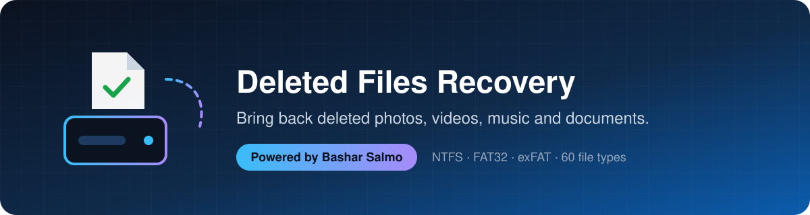
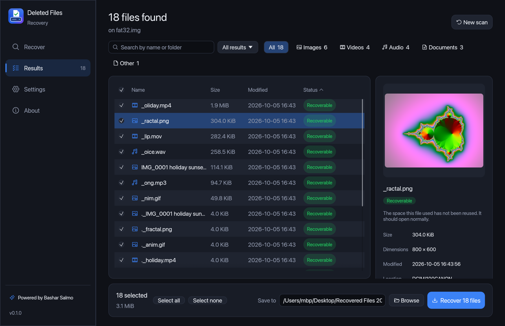
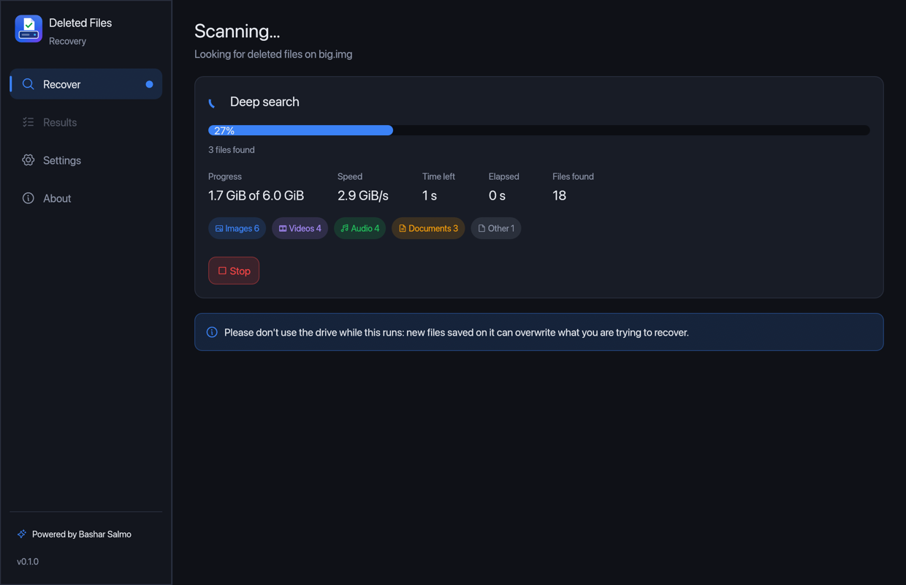
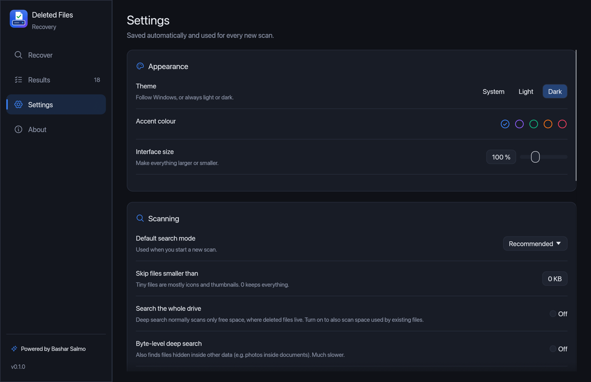
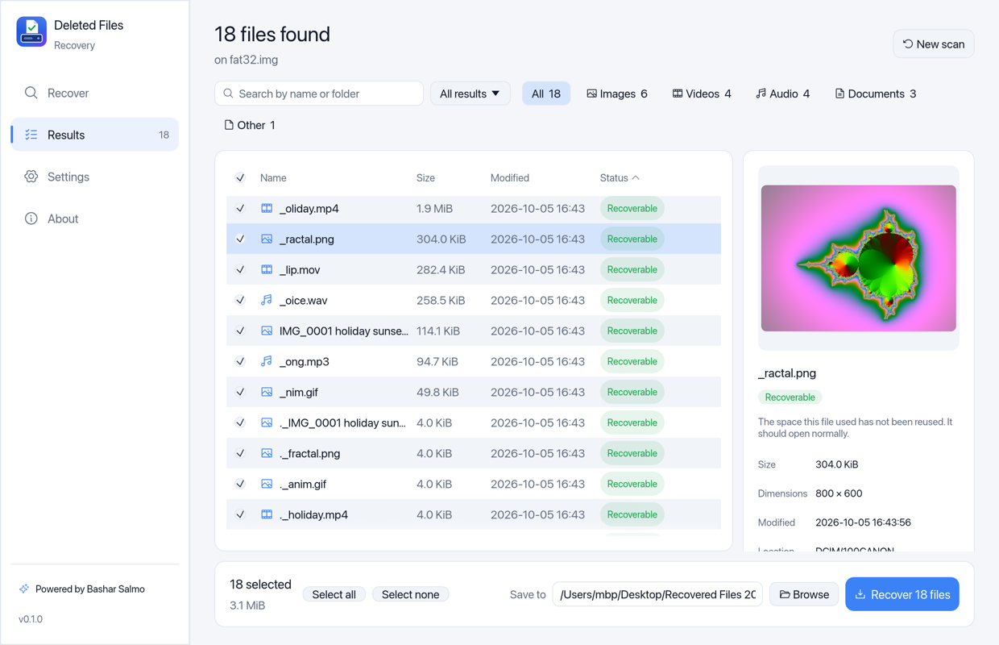
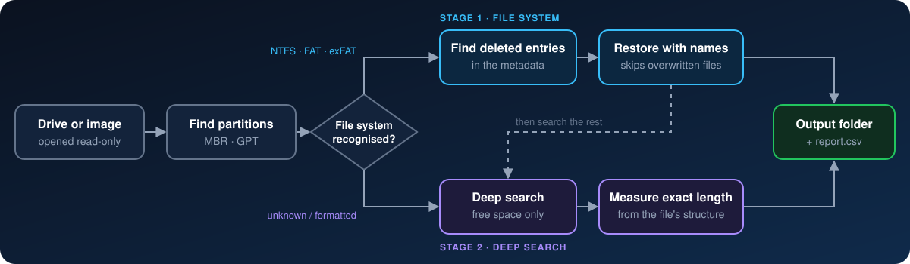

<div align="center">



<br>

[](https://github.com/itsmrroot/Recover-Deleted-Files/actions/workflows/ci.yml)
[](https://github.com/itsmrroot/Recover-Deleted-Files/releases/latest)
[](https://github.com/itsmrroot/Recover-Deleted-Files/releases)
[](#-install)
[](https://www.rust-lang.org)
[](LICENSE)

**Bring back deleted photos, videos, music and documents —<br>from hard drives, USB sticks, SD cards and disk images.**

[](#-windows)
[](#-macos)
[](#-linux)

[Quick start](#-quick-start) •
[Install](#-install) •
[Desktop app](#%EF%B8%8F-the-desktop-app) •
[Features](#-features) •
[Command line](#-command-line) •
[How it works](#%EF%B8%8F-how-it-works) •
[File types](#%EF%B8%8F-supported-file-types) •
[FAQ](#-faq)

</div>

---

## ✨ Features

<table>
<tr>
<td width="50%" valign="top">

### 🖥️ Modern desktop app
Pick a drive, scan, preview photos, tick the files you want and click
**Recover**. In English, German, Spanish, French, Turkish, Russian, Arabic and
Chinese, with Midnight (the default), dark and light themes, accent colours and saved settings.
A built-in Help page walks through common situations step by step.
The app tells you when a new version is out and installs it in one click.

</td>
<td width="50%" valign="top">

### 📁 Original names & folders
On **NTFS**, **FAT32** and **exFAT**, deleted files come back with their real
names, folders and dates.

</td>
</tr>
<tr>
<td valign="top">

### 🔍 Deep search
Formatted card? Corrupted drive? Files are found by their content in **~50 file
types**, and each is cut at its **exact** length — no broken or bloated files.

</td>
<td valign="top">

### 🛡️ Safe by design
The drive is opened **read-only**, and saving onto the drive you are recovering
is refused. Bad sectors are skipped, not fatal.

</td>
</tr>
<tr>
<td valign="top">

### 🩺 Honest results
Every file is checked against the drive's allocation map and marked
**recoverable**, **partial** or **overwritten** — no guessing. Files an SSD has
already wiped (TRIM) are detected and marked **erased** instead of promising
files full of zeros.

</td>
<td valign="top">

### ⚡ Fast & portable
Installers for Windows, macOS and Linux, or portable single executables with no
runtime — nothing is written to the damaged drive. Scans at full disk speed.

</td>
</tr>
<tr>
<td valign="top">

### 🏷️ Real names, even without a file system
Files from an emptied **Recycle Bin** get their original name and folder back.
Files found by their content are named from what is inside them —
`2024-08-21 18.45.03 iPhone 15 Pro.jpg`, `Artist - Title.mp3`, a PDF's title —
and dated, so they can be filtered by year.

</td>
<td valign="top">

### 🧹 No clutter, no waiting
Identical copies are found (confirmed byte by byte) and hidden. Browse and preview
files **while the scan is still running**, and save a scan to reopen it later
without scanning again.

</td>
</tr>
</table>

## 🚀 Quick start

> [!IMPORTANT]
> **Stop using the drive right away.** Every new file saved to it can overwrite the files you want back.

1. **Install** the app for your system: **[Windows](#-windows)** · **[macOS](#-macos)** · **[Linux](#-linux)**
   (on a **different** drive than the one you want to recover).
2. Open **Deleted Files Recovery**. Windows asks for administrator rights: click **Yes**. On macOS, click
   **Allow access to drives**, enter your password and give the app [Full Disk Access](#-macos). On Linux,
   click **Restart with administrator rights** and enter your password.
3. Choose the drive, click **Start scan**, tick the files you want and click **Recover**.

<div align="center">

</div>

> [!TIP]
> Prefer the keyboard? **`wdfr`** (included in every download) opens a step-by-step text menu, and offers every
> option on the command line.

## 🖥️ The desktop app

| | |
|---|---|
| **1 · Choose** | Every drive is listed as Windows names it (*USB Drive (E:)*, *Local Disk (C:)*) with its size and file system. Disk images can be opened or simply dragged onto the window. Pick what you are looking for — photos, videos, audio, documents… — and how deep to search. |
| **2 · Scan** | Live progress with speed, time left and a running count of what was found, by type. Stop at any time: everything found so far is kept. |
| **3 · Choose files** | A fast, searchable, sortable list of everything found — even hundreds of thousands of files. Filter by type or by how each file was found, preview photos and text files, and see whether each file is *recoverable*, *partial* or *overwritten* (and why). |
| **4 · Recover** | A folder on another drive is suggested automatically; saving onto the drive being recovered is refused. When done, the folder opens with your files and a report. |

<table>
<tr>
<td width="50%"><p align="center"><sub>Scanning</sub></p></td>
<td width="50%"><p align="center"><sub>Settings</sub></p></td>
</tr>
<tr>
<td colspan="2"><p align="center"><sub>Light mode</sub></p></td>
</tr>
</table>

**Settings** (saved automatically): language (system / English / Deutsch / Español / Français / Türkçe /
Русский / العربية / 简体中文), theme
(Midnight / dark / light / system), accent colour, checking for updates at start, interface size, default
search mode, minimum file size, whole-drive and byte-level deep search, largest file size, showing whole
disks, default destination, folder layout (*original folders* or *sorted by type*), restoring original
dates, the CSV report, opening the folder when done, showing overwritten files — and, clearly marked as
unsafe, allowing saves to the source drive.

## 📥 Install

Click your system to see which file to download and how to install it:

<div align="center">

[](#-windows)
[](#-macos)
[](#-linux)
[](#-command-line-only)
[-6b7280?style=for-the-badge&logo=files&logoColor=white)](#-portable-no-installation)

</div>

Every installer contains the desktop app **and** the command line (`wdfr`). All files are also on the
**[latest release](https://github.com/itsmrroot/Recover-Deleted-Files/releases/latest)** page.

> [!IMPORTANT]
> Download and install the app on a **different drive** than the one you want to recover, so that nothing
> overwrites the deleted files.

### 🪟 Windows

**1. Download** the installer for your PC:

| Your PC | Download |
|---|---|
| **Most PCs** (Intel or AMD) | **[wdfr-windows-x64-setup.exe](https://github.com/itsmrroot/Recover-Deleted-Files/releases/latest/download/wdfr-windows-x64-setup.exe)** |
| ARM laptops (Snapdragon, Surface Pro X) | [wdfr-windows-arm64-setup.exe](https://github.com/itsmrroot/Recover-Deleted-Files/releases/latest/download/wdfr-windows-arm64-setup.exe) |

<sub>Not sure? **Settings → System → About → System type** says *x64-based* or *ARM-based*.</sub>

**2. Install**

1. Double-click the downloaded file.
2. If Windows shows **"Windows protected your PC"**, click **More info → Run anyway**. (The app is new and
   not code-signed yet.)
3. Pick your language, click **Next → Install** and **Yes** when Windows asks for permission.

**3. Start**: open the **Start menu** → **Deleted Files Recovery**, and click **Yes** when Windows asks for
administrator rights (needed to read drives).

<sub>**Uninstall:** Settings → Apps → Installed apps → *Deleted Files Recovery* → Uninstall.</sub>

### 🍎 macOS

**1. Download** the disk image for your Mac:

| Your Mac | Download |
|---|---|
| **Apple Silicon** (M1, M2, M3, M4 and newer) | **[wdfr-macos-apple-silicon.dmg](https://github.com/itsmrroot/Recover-Deleted-Files/releases/latest/download/wdfr-macos-apple-silicon.dmg)** |
| Intel | [wdfr-macos-intel.dmg](https://github.com/itsmrroot/Recover-Deleted-Files/releases/latest/download/wdfr-macos-intel.dmg) |

<sub>Not sure? **Apple menu  → About This Mac** shows *Chip: Apple M…* or *Processor: Intel*.</sub>

**2. Install**

1. Open the downloaded `.dmg`.
2. Drag **Deleted Files Recovery** onto the **Applications** folder.
3. The first time, macOS blocks the app because it is not signed by Apple yet:
   - **macOS 15 Sequoia and newer:** open the app, click **Done**, then go to **System Settings → Privacy &
     Security**, scroll down and click **Open Anyway**.
   - **macOS 14 and older:** in Applications, **right-click** (or Control-click) the app → **Open** → **Open**.

   You only need to do this once.

**3. Start**: open **Deleted Files Recovery** from Applications or Launchpad. To read drives:

1. Click **Allow access to drives** and enter your Mac password.
2. macOS also needs **Full Disk Access**, even for administrators. Click **Open Full Disk Access settings**
   (or go to **System Settings → Privacy & Security → Full Disk Access**), turn on **Deleted Files
   Recovery** (use **+** if it is not listed), then click **Refresh** in the app.

Disk images work without either step.

> [!NOTE]
> On a Mac, the app is most useful for **USB sticks, SD cards and external drives** (FAT32, exFAT, NTFS).
> The Mac's own drive (APFS) can only be searched by content, and its SSD usually erases deleted data on its own.

<sub>**Uninstall:** drag *Deleted Files Recovery* from Applications to the Trash.</sub>

### 🐧 Linux

**1. Download** the package for your distribution and processor:

| Your distribution | Intel / AMD (`x86_64`) | ARM (`aarch64`) |
|---|---|---|
| **Ubuntu, Debian, Mint, Pop!_OS** | **[wdfr-linux-x86_64.deb](https://github.com/itsmrroot/Recover-Deleted-Files/releases/latest/download/wdfr-linux-x86_64.deb)** | [wdfr-linux-arm64.deb](https://github.com/itsmrroot/Recover-Deleted-Files/releases/latest/download/wdfr-linux-arm64.deb) |
| **Fedora, openSUSE, RHEL** | [wdfr-linux-x86_64.rpm](https://github.com/itsmrroot/Recover-Deleted-Files/releases/latest/download/wdfr-linux-x86_64.rpm) | [wdfr-linux-arm64.rpm](https://github.com/itsmrroot/Recover-Deleted-Files/releases/latest/download/wdfr-linux-arm64.rpm) |
| **Any other** (AppImage) | [wdfr-linux-x86_64.AppImage](https://github.com/itsmrroot/Recover-Deleted-Files/releases/latest/download/wdfr-linux-x86_64.AppImage) | [wdfr-linux-arm64.AppImage](https://github.com/itsmrroot/Recover-Deleted-Files/releases/latest/download/wdfr-linux-arm64.AppImage) |

<sub>Not sure? Run `uname -m` in a terminal: `x86_64` is Intel/AMD, `aarch64` is ARM (Raspberry Pi 4/5 with
a 64-bit system, ARM servers, Linux virtual machines on Apple Silicon Macs). The app needs Ubuntu 22.04,
Debian 12, Fedora 36, Mint 21 or newer.</sub>

**2. Install** (in a terminal, in the folder you downloaded to, e.g. `cd ~/Downloads`). Use the file name you
downloaded; the examples show Intel/AMD.

<details open>
<summary><b>Ubuntu, Debian, Mint (.deb)</b></summary>

```bash
sudo apt install ./wdfr-linux-x86_64.deb
```

</details>

<details>
<summary><b>Fedora, openSUSE, RHEL (.rpm)</b></summary>

```bash
sudo dnf install ./wdfr-linux-x86_64.rpm       # Fedora, RHEL
sudo zypper install ./wdfr-linux-x86_64.rpm    # openSUSE
```

</details>

<details>
<summary><b>Any distribution (AppImage, no installation)</b></summary>

```bash
chmod +x wdfr-linux-x86_64.AppImage
./wdfr-linux-x86_64.AppImage
```

If it complains about `libfuse.so.2`, install FUSE 2 (`sudo apt install libfuse2` on Ubuntu 22.04,
`libfuse2t64` on 24.04) or start it with `--appimage-extract-and-run`.

</details>

**3. Start**: open **Deleted Files Recovery** from your app menu (or run `wdfr-gui` in a terminal). To read
drives, click **Restart with administrator rights** and enter your password. Disk images work without it.

<details>
<summary><b>The app does not open</b></summary>

Run `wdfr-gui` in a terminal to see why:

- **`GLIBC_2.xx not found`**: your distribution is older than the versions above. Use the
  [command line](#-command-line-only) instead, which runs everywhere.
- **Nothing appears in a virtual machine**: turn on **3D acceleration** in the VM's display settings. The app
  draws its window with your graphics card (Vulkan or OpenGL).

</details>

<sub>**Uninstall:** `sudo apt remove deleted-files-recovery` (.deb), `sudo dnf remove wdfr` (.rpm), or delete
the AppImage.</sub>

### 💻 Command line only

The command line runs on any Linux, with no dependencies, and is also included in every installer and
portable download. Download it from the [latest release](https://github.com/itsmrroot/Recover-Deleted-Files/releases/latest):

| Your computer | File |
|---|---|
| Linux, Intel/AMD | `wdfr-…-x86_64-unknown-linux-musl.tar.gz` |
| Linux, ARM | `wdfr-…-aarch64-unknown-linux-musl.tar.gz` |

```bash
tar xzf wdfr-*-linux-musl.tar.gz
sudo ./wdfr-*/wdfr          # step-by-step menu; see "Command line" below for all commands
```

### 📦 Portable (no installation)

Unpack and run, nothing is installed. All files are on the
[latest release](https://github.com/itsmrroot/Recover-Deleted-Files/releases/latest) page:

| Your computer | File | Contains |
|---|---|---|
| Windows (Intel/AMD) | `wdfr-…-x86_64-pc-windows-msvc.zip` | desktop app + command line |
| Windows on ARM | `wdfr-…-aarch64-pc-windows-msvc.zip` | desktop app + command line |
| Mac with Apple Silicon | `wdfr-…-aarch64-apple-darwin.tar.gz` | desktop app + command line |
| Mac with Intel | `wdfr-…-x86_64-apple-darwin.tar.gz` | desktop app + command line |
| Linux, Intel/AMD | `wdfr-…-x86_64-unknown-linux-gnu-desktop.tar.gz` | desktop app |
| Linux, ARM | `wdfr-…-aarch64-unknown-linux-gnu-desktop.tar.gz` | desktop app |

On macOS and Linux, start the portable app with `sudo ./wdfr-gui` to read drives; disk images work without `sudo`.
On macOS, the Terminal app also needs Full Disk Access (System Settings → Privacy & Security).

## 💻 Command line

`wdfr` (no arguments) opens a step-by-step text menu. Everything is also available as a command — handy for
scripts and power users.

```powershell
wdfr devices                         # list drives
wdfr info E:                         # partitions and file systems on E:
wdfr scan E:                         # list deleted files (writes nothing)
wdfr recover E: -o D:\Recovered      # recover everything to another drive
```

<details>
<summary><b>More recipes</b></summary>

```powershell
# Only photos and videos
wdfr recover E: -o D:\Recovered --category image,video

# Only specific types
wdfr recover E: -o D:\Recovered --type jpg,heic,mp4,mov

# Files from a particular folder, by name pattern
wdfr scan C: --name "Users/*/Documents/**" --type docx,xlsx,pdf

# Skip tiny files (thumbnails, icons)
wdfr recover E: -o D:\Recovered --category image --min-size 100K

# Card was formatted / file system is unreadable: search by content only
wdfr recover E: -o D:\Recovered --method carve

# Whole physical disk (all partitions + unpartitioned space,
# e.g. after a partition was deleted)
wdfr info \\.\PhysicalDrive1
wdfr recover \\.\PhysicalDrive1 -o D:\Recovered

# Only one partition of it
wdfr recover \\.\PhysicalDrive1 -p 2 -o D:\Recovered

# Only files dated in 2024 (carved photos are dated from their EXIF data)
wdfr recover E: -o D:\Recovered --after 2024-01-01 --before 2024-12-31

# Also write identical copies (skipped by default)
wdfr recover E: -o D:\Recovered --keep-duplicates

# Machine-readable listing
wdfr scan E: --json > deleted.json
```

On macOS and Linux use the device path with `sudo`, e.g. `sudo wdfr recover /dev/rdisk4 -o ~/Recovered`
(on macOS, give your terminal app Full Disk Access in System Settings → Privacy & Security first).
Disk images (`.dd`, `.img`, `.raw`, ddrescue output) work everywhere without admin rights:
`wdfr recover card.img -o Recovered`.

Press **Ctrl+C** once to stop gracefully (everything found so far is kept), twice to abort immediately.

</details>

<details>
<summary><b>What you get in the output folder</b></summary>

```text
D:\Recovered\
├── partition1_NTFS\           files recovered with their names,
│   ├── Users\bob\Pictures\…   in their original folders
│   └── $Orphan\…              files whose parent folder no longer exists
├── carved\                    files found by deep search, sorted by type
│   ├── images\f00001a2b3000.jpg
│   ├── videos\…
│   └── audio\  documents\  archives\  databases\
└── report.csv                 one row per recovered file
```

Deep-search files are named after their position on the disk (`f<hex offset>`), so every result is traceable.
`report.csv` lists how each file was recovered, its original and new path, size, disk offset, condition,
modification time and notes. Recovered files keep their original modification time.

</details>

## ⚙️ How it works



**Stage 1 — file-system metadata.** Deleted files usually leave their entry behind. `wdfr` reads it to restore the
name, folder, dates and the location of the data, then checks whether those clusters were reused since.

**Stage 2 — deep search (carving).** The free space of every volume and any unpartitioned space is scanned for file
signatures. Rather than cutting at a fixed size, each format parser walks the file's own structure — JPEG segments,
MP4 boxes, ZIP central directory, PDF trailers, … — to find exactly where it ends. Space already restored in stage 1 is
skipped, so nothing is recovered twice and existing files are left out.

<details>
<summary><b>Technical details per file system</b></summary>

| File system | What survives deletion | What `wdfr` does |
|---|---|---|
| **NTFS** | The MFT record (name, parent, timestamps, data run list) until it is reused | Scans every MFT record (applying update-sequence fixups), rebuilds paths from parent references with sequence-number checks, follows `$ATTRIBUTE_LIST` extension records, decompresses LZNT1-compressed files, handles sparse files, resident (tiny) files and alternate data streams |
| **FAT12/16/32** | The directory entry, minus its first character; the cluster chain is erased | Reconstructs long file names (recovering the lost first character from the LFN checksum), walks into deleted folders (verifying each claimed folder cluster through its `..` back-pointer), and assigns clusters to files around other files to undo common fragmentation; restores the high word of FAT32 start clusters that Windows clears |
| **exFAT** | The whole entry set, with the "in use" bit cleared | Recovers exact names and sizes; uses the `NoFatChain` flag or the FAT chain when it survives, contiguous allocation otherwise |

Carving parsers: JPEG marker segments and entropy-coded scans, PNG chunks, MP4/MOV box trees, Matroska EBML elements,
RIFF chunks (incl. AVI OpenDML), ASF headers, transport-stream packets, MP3 frames, Ogg pages, ZIP central directories
with offset consistency checks, OLE2 sector allocation tables, and 7z/RAR headers with CRC validation.

</details>

## 🗂️ Supported file types

| | Formats |
|---|---|
| 🖼️ **Images** | JPEG · PNG · GIF · BMP · TIFF · HEIC/HEIF · AVIF · WebP · camera RAW (CR2 · CR3 · NEF · ARW · DNG · PEF · SRW) |
| 🎬 **Video** | MP4 · MOV · M4V · 3GP · MKV · WebM · AVI · WMV · MTS/M2TS (AVCHD) · TS |
| 🎵 **Audio** | MP3 · WAV · M4A · WMA · OGG · Opus |
| 📄 **Documents** | PDF · DOCX · XLSX · PPTX · DOC · XLS · PPT · MSG · ODT · ODS · ODP · EPUB |
| 🗜️ **Archives** | ZIP · 7z · RAR (v4 & v5) · JAR · APK |
| 🗄️ **Databases** | SQLite |

Files recovered through the file system (stage 1) can be **any** type — the list above applies to the deep search.

## ✅ Tested on real data

Besides 40+ unit and integration tests (including the full scan-and-save pipeline) running on Windows, macOS and Linux for every change, `wdfr` was checked against
the public [Digital Forensics Tool Testing](https://dftt.sourceforge.net/) images and real volumes:

| Test | Result |
|---|---|
| DFTT #7 — NTFS undelete | **9 / 9** files with correct MD5 and dates (incl. fragmented files, deleted folders and an alternate data stream) |
| DFTT #11 — deep search | **13 / 15** exact MD5 — misses are a deliberately corrupted JPEG and a WAV with one extra byte outside its structure |
| DFTT #6 — FAT undelete | **4 / 6** correct MD5 — the other two are deliberately interleaved cluster by cluster, which no metadata can untangle |
| Real FAT32 and exFAT volumes | **All** deleted files byte-identical, incl. a fragmented video and whole deleted folder trees |
| 19 real files hidden in random data | **19 / 19** byte-identical, no false results |
| 1 GB of random data | **0** false results |

## ❓ FAQ

<details>
<summary><b>Can it recover files from an SSD?</b></summary>

Often not. Windows tells the SSD which blocks were freed (TRIM), and the SSD may erase them within seconds or minutes.
Nothing can recover data the drive itself has wiped. The app detects this and marks such files **erased by the drive**
instead of listing them as recoverable. USB sticks, SD cards and hard drives usually recover well.

</details>

<details>
<summary><b>Why is a file marked "overwritten"?</b></summary>

Its space on the drive has since been used by another file, so the original content is gone. Such files are skipped by
default; `--include-overwritten` writes them anyway (usually as garbage).

</details>

<details>
<summary><b>Why do some files have names like <code>_mage.jpg</code> or <code>f0001a2b3000.jpg</code>?</b></summary>

FAT/exFAT deletion destroys the first character of short names, so it is replaced by `_`. Files found by the deep
search have no name left at all; they are named after their position on the disk.

</details>

<details>
<summary><b>The drive makes noises or is very slow.</b></summary>

Copy it to an image file first with [GNU ddrescue](https://www.gnu.org/software/ddrescue/) and run `wdfr` on the image.
`wdfr` tolerates bad sectors, but every extra read stresses a dying drive.

</details>

<details>
<summary><b>Does it work with BitLocker or EFS?</b></summary>

For BitLocker, recover from the *unlocked* volume (e.g. `E:`), not the physical disk. EFS-encrypted files are recovered
as ciphertext and flagged in the report.

</details>

<details>
<summary><b>What about ext4, APFS, HFS+ or other file systems?</b></summary>

They are supported by the deep search (content-based), without original names. The deep search assumes each file is
stored in one piece, which is true for most camera and phone media.

</details>

## 🛠️ Build from source

Requires [Rust](https://rustup.rs) 1.88 or newer.

```sh
cargo build --release --workspace   # → target/release/wdfr(.exe) and wdfr-gui(.exe)
cargo test --workspace              # unit + integration tests
```

Release builds for every platform are produced automatically when a version tag (`v*`) is pushed. The Windows binary
links the C runtime statically, so it runs on a bare Windows install.

<details>
<summary><b>Code layout</b></summary>

| Module | Responsibility |
|---|---|
| `gui/` | The desktop app (egui): screens, theme, settings, background jobs, previews |
| `menu` | Interactive text menu of the command line |
| `progress` | Progress reporting shared by the command line and the desktop app |
| `source` | Read-only device/image access: sector alignment for raw devices, bad-sector tolerant reads |
| `partition` | MBR (incl. extended/logical) and GPT discovery, file-system detection |
| `fs::ntfs` | MFT parsing, fixups, run lists, attribute lists, LZNT1 |
| `fs::fat`, `fs::exfat` | Directory walking, long-name recovery, cluster assignment |
| `carve` | Deep-search scanner and per-format structure parsers |
| `recover` | Scan / save orchestration, de-duplication between stages, report |
| `output` | Safe naming — recovered names are untrusted and can never escape the output folder |

</details>

---

<div align="center">

**Powered by Bashar Salmo**

Released under the [MIT License](LICENSE). The desktop app bundles
[Noto Sans Arabic](https://github.com/notofonts/arabic) and [Noto Sans SC](https://github.com/notofonts/noto-cjk)
under the SIL Open Font License ([Arabic](gui/assets/fonts/OFL.txt), [SC](gui/assets/fonts/OFL-NotoSansSC.txt)).

</div>
