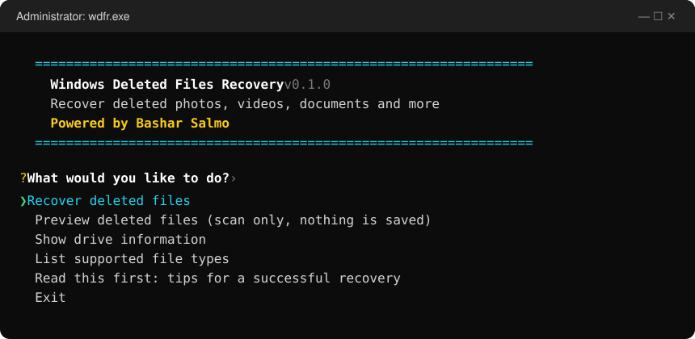
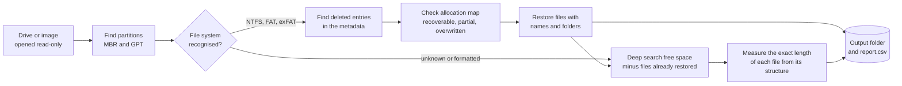

<div align="center">


<br>

[](https://github.com/itsmrroot/Windows-Deleted-Files-Recovery/actions/workflows/ci.yml)
[](https://github.com/itsmrroot/Windows-Deleted-Files-Recovery/releases/latest)
[](https://github.com/itsmrroot/Windows-Deleted-Files-Recovery/releases)
[](#-download)
[](https://www.rust-lang.org)
[](LICENSE)

**Bring back deleted photos, videos, music and documents —<br>from hard drives, USB sticks, SD cards and disk images.**

[](https://github.com/itsmrroot/Windows-Deleted-Files-Recovery/releases/latest)
[](https://github.com/itsmrroot/Windows-Deleted-Files-Recovery/releases/latest)
[](https://github.com/itsmrroot/Windows-Deleted-Files-Recovery/releases/latest)

[Quick start](#-quick-start) •
[Features](#-features) •
[Command line](#-command-line) •
[How it works](#%EF%B8%8F-how-it-works) •
[File types](#%EF%B8%8F-supported-file-types) •
[FAQ](#-faq)

</div>

---

## ✨ Features

<table>
<tr>
<td width="50%" valign="top">

### 🖱️ No typing needed
Double-click and choose from a menu with the arrow keys. A step-by-step guide
asks what you lost and where to save it.

</td>
<td width="50%" valign="top">

### 📁 Original names & folders
On **NTFS**, **FAT32** and **exFAT**, deleted files come back with their real
names, folders and dates.

</td>
</tr>
<tr>
<td valign="top">

### 🔍 Deep search
Formatted card? Corrupted drive? Files are found by their content in **~50 file
types**, and each is cut at its **exact** length — no broken or bloated files.

</td>
<td valign="top">

### 🛡️ Safe by design
The drive is opened **read-only**, and saving onto the drive you are recovering
is refused. Bad sectors are skipped, not fatal.

</td>
</tr>
<tr>
<td valign="top">

### 🩺 Honest results
Every file is checked against the drive's allocation map and marked
**recoverable**, **partial** or **overwritten** — no guessing.

</td>
<td valign="top">

### ⚡ Fast & portable
One ~1 MB executable. No installer, no runtime, nothing written to the damaged
drive. Scans at full disk speed.

</td>
</tr>
</table>

## 🚀 Quick start

> [!IMPORTANT]
> **Stop using the drive right away.** Every new file saved to it can overwrite the files you want back.

1. **[Download](https://github.com/itsmrroot/Windows-Deleted-Files-Recovery/releases/latest)**
   `wdfr-…-x86_64-pc-windows-msvc.zip` and unzip it on a **different** drive
   than the one you want to recover.
2. Right-click **`wdfr.exe`** → **Run as administrator** (needed to read drives).
3. Choose **Recover deleted files** and follow the questions.

<div align="center">

</div>

The guide asks, one question at a time:

| Step | You choose |
|:---:|---|
| 1 | **Which drive** — every drive is listed with its size and file system |
| 2 | **What to look for** — everything, photos, videos, music, documents, or specific types like `jpg, mp4` |
| 3 | **How deep to search** — *Recommended*, *Quick*, or *Formatted / corrupted drive* |
| 4 | **Where to save** — a folder on your Desktop is suggested; it must be on another drive |

When it finishes, it offers to open the folder with your files.

> [!TIP]
> Not sure what can be saved? Pick **Preview deleted files** first — it lists what was found without writing anything.

> [!NOTE]
> Windows may show **"Windows protected your PC"** the first time, because the program is new and not code-signed. Click **More info → Run anyway**.

## 📥 Download

| Your computer | File |
|---|---|
| **Windows** (most PCs) | `wdfr-…-x86_64-pc-windows-msvc.zip` |
| Windows on ARM | `wdfr-…-aarch64-pc-windows-msvc.zip` |
| Mac with Apple Silicon (M1–M4) | `wdfr-…-aarch64-apple-darwin.tar.gz` |
| Mac with Intel | `wdfr-…-x86_64-apple-darwin.tar.gz` |
| Linux | `wdfr-…-x86_64-unknown-linux-musl.tar.gz` |

All downloads are on the **[latest release](https://github.com/itsmrroot/Windows-Deleted-Files-Recovery/releases/latest)** page.
On macOS and Linux, run `sudo ./wdfr` to open the menu.

## 💻 Command line

Everything in the menu is also available as a command — handy for scripts and power users.

```powershell
wdfr devices                         # list drives
wdfr info E:                         # partitions and file systems on E:
wdfr scan E:                         # list deleted files (writes nothing)
wdfr recover E: -o D:\Recovered      # recover everything to another drive
```

<details>
<summary><b>More recipes</b></summary>

```powershell
# Only photos and videos
wdfr recover E: -o D:\Recovered --category image,video

# Only specific types
wdfr recover E: -o D:\Recovered --type jpg,heic,mp4,mov

# Files from a particular folder, by name pattern
wdfr scan C: --name "Users/*/Documents/**" --type docx,xlsx,pdf

# Skip tiny files (thumbnails, icons)
wdfr recover E: -o D:\Recovered --category image --min-size 100K

# Card was formatted / file system is unreadable: search by content only
wdfr recover E: -o D:\Recovered --method carve

# Whole physical disk (all partitions + unpartitioned space,
# e.g. after a partition was deleted)
wdfr info \\.\PhysicalDrive1
wdfr recover \\.\PhysicalDrive1 -o D:\Recovered

# Only one partition of it
wdfr recover \\.\PhysicalDrive1 -p 2 -o D:\Recovered

# Machine-readable listing
wdfr scan E: --json > deleted.json
```

On macOS and Linux use the device path with `sudo`, e.g. `sudo wdfr recover /dev/rdisk4 -o ~/Recovered`.
Disk images (`.dd`, `.img`, `.raw`, ddrescue output) work everywhere without admin rights:
`wdfr recover card.img -o Recovered`.

Press **Ctrl+C** once to stop gracefully (everything found so far is kept), twice to abort immediately.

</details>

<details>
<summary><b>What you get in the output folder</b></summary>

```text
D:\Recovered\
├── partition1_NTFS\           files recovered with their names,
│   ├── Users\bob\Pictures\…   in their original folders
│   └── $Orphan\…              files whose parent folder no longer exists
├── carved\                    files found by deep search, sorted by type
│   ├── images\f00001a2b3000.jpg
│   ├── videos\…
│   └── audio\  documents\  archives\  databases\
└── report.csv                 one row per recovered file
```

Deep-search files are named after their position on the disk (`f<hex offset>`), so every result is traceable.
`report.csv` lists how each file was recovered, its original and new path, size, disk offset, condition,
modification time and notes. Recovered files keep their original modification time.

</details>

## ⚙️ How it works



**Stage 1 — file-system metadata.** Deleted files usually leave their entry behind. `wdfr` reads it to restore the
name, folder, dates and the location of the data, then checks whether those clusters were reused since.

**Stage 2 — deep search (carving).** The free space of every volume and any unpartitioned space is scanned for file
signatures. Rather than cutting at a fixed size, each format parser walks the file's own structure — JPEG segments,
MP4 boxes, ZIP central directory, PDF trailers, … — to find exactly where it ends. Space already restored in stage 1 is
skipped, so nothing is recovered twice and existing files are left out.

<details>
<summary><b>Technical details per file system</b></summary>

| File system | What survives deletion | What `wdfr` does |
|---|---|---|
| **NTFS** | The MFT record (name, parent, timestamps, data run list) until it is reused | Scans every MFT record (applying update-sequence fixups), rebuilds paths from parent references with sequence-number checks, follows `$ATTRIBUTE_LIST` extension records, decompresses LZNT1-compressed files, handles sparse files, resident (tiny) files and alternate data streams |
| **FAT12/16/32** | The directory entry, minus its first character; the cluster chain is erased | Reconstructs long file names (recovering the lost first character from the LFN checksum), walks into deleted folders (verifying each claimed folder cluster through its `..` back-pointer), and assigns clusters to files around other files to undo common fragmentation; restores the high word of FAT32 start clusters that Windows clears |
| **exFAT** | The whole entry set, with the "in use" bit cleared | Recovers exact names and sizes; uses the `NoFatChain` flag or the FAT chain when it survives, contiguous allocation otherwise |

Carving parsers: JPEG marker segments and entropy-coded scans, PNG chunks, MP4/MOV box trees, Matroska EBML elements,
RIFF chunks (incl. AVI OpenDML), ASF headers, transport-stream packets, MP3 frames, Ogg pages, ZIP central directories
with offset consistency checks, OLE2 sector allocation tables, and 7z/RAR headers with CRC validation.

</details>

## 🗂️ Supported file types

| | Formats |
|---|---|
| 🖼️ **Images** | JPEG · PNG · GIF · BMP · TIFF · HEIC/HEIF · AVIF · WebP · camera RAW (CR2 · CR3 · NEF · ARW · DNG · PEF · SRW) |
| 🎬 **Video** | MP4 · MOV · M4V · 3GP · MKV · WebM · AVI · WMV · MTS/M2TS (AVCHD) · TS |
| 🎵 **Audio** | MP3 · WAV · M4A · WMA · OGG · Opus |
| 📄 **Documents** | PDF · DOCX · XLSX · PPTX · DOC · XLS · PPT · MSG · ODT · ODS · ODP · EPUB |
| 🗜️ **Archives** | ZIP · 7z · RAR (v4 & v5) · JAR · APK |
| 🗄️ **Databases** | SQLite |

Files recovered through the file system (stage 1) can be **any** type — the list above applies to the deep search.

## ✅ Tested on real data

Besides 40+ unit and integration tests running on Windows, macOS and Linux for every change, `wdfr` was checked against
the public [Digital Forensics Tool Testing](https://dftt.sourceforge.net/) images and real volumes:

| Test | Result |
|---|---|
| DFTT #7 — NTFS undelete | **9 / 9** files with correct MD5 and dates (incl. fragmented files, deleted folders and an alternate data stream) |
| DFTT #11 — deep search | **13 / 15** exact MD5 — misses are a deliberately corrupted JPEG and a WAV with one extra byte outside its structure |
| DFTT #6 — FAT undelete | **4 / 6** correct MD5 — the other two are deliberately interleaved cluster by cluster, which no metadata can untangle |
| Real FAT32 and exFAT volumes | **All** deleted files byte-identical, incl. a fragmented video and whole deleted folder trees |
| 19 real files hidden in random data | **19 / 19** byte-identical, no false results |
| 1 GB of random data | **0** false results |

## ❓ FAQ

<details>
<summary><b>Can it recover files from an SSD?</b></summary>

Often not. Windows tells the SSD which blocks were freed (TRIM), and the SSD may erase them within seconds or minutes.
Nothing can recover data the drive itself has wiped. USB sticks, SD cards and hard drives usually recover well.

</details>

<details>
<summary><b>Why is a file marked "overwritten"?</b></summary>

Its space on the drive has since been used by another file, so the original content is gone. Such files are skipped by
default; `--include-overwritten` writes them anyway (usually as garbage).

</details>

<details>
<summary><b>Why do some files have names like <code>_mage.jpg</code> or <code>f0001a2b3000.jpg</code>?</b></summary>

FAT/exFAT deletion destroys the first character of short names, so it is replaced by `_`. Files found by the deep
search have no name left at all; they are named after their position on the disk.

</details>

<details>
<summary><b>The drive makes noises or is very slow.</b></summary>

Copy it to an image file first with [GNU ddrescue](https://www.gnu.org/software/ddrescue/) and run `wdfr` on the image.
`wdfr` tolerates bad sectors, but every extra read stresses a dying drive.

</details>

<details>
<summary><b>Does it work with BitLocker or EFS?</b></summary>

For BitLocker, recover from the *unlocked* volume (e.g. `E:`), not the physical disk. EFS-encrypted files are recovered
as ciphertext and flagged in the report.

</details>

<details>
<summary><b>What about ext4, APFS, HFS+ or other file systems?</b></summary>

They are supported by the deep search (content-based), without original names. The deep search assumes each file is
stored in one piece, which is true for most camera and phone media.

</details>

## 🛠️ Build from source

Requires [Rust](https://rustup.rs) 1.88 or newer.

```sh
cargo build --release    # → target/release/wdfr(.exe)
cargo test               # unit + integration tests
```

Release builds for every platform are produced automatically when a version tag (`v*`) is pushed. The Windows binary
links the C runtime statically, so it runs on a bare Windows install.

<details>
<summary><b>Code layout</b></summary>

| Module | Responsibility |
|---|---|
| `menu` | Interactive, menu-driven mode |
| `source` | Read-only device/image access: sector alignment for raw devices, bad-sector tolerant reads |
| `partition` | MBR (incl. extended/logical) and GPT discovery, file-system detection |
| `fs::ntfs` | MFT parsing, fixups, run lists, attribute lists, LZNT1 |
| `fs::fat`, `fs::exfat` | Directory walking, long-name recovery, cluster assignment |
| `carve` | Deep-search scanner and per-format structure parsers |
| `recover` | Orchestration, de-duplication between stages, progress, report |
| `output` | Safe naming — recovered names are untrusted and can never escape the output folder |

</details>

---

<div align="center">

**Powered by Bashar Salmo**

Released under the [MIT License](LICENSE)

</div>
